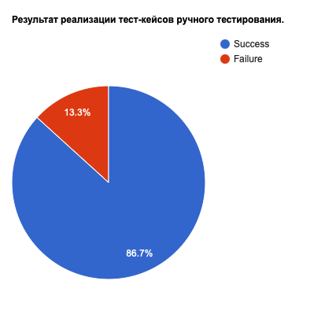

<h1>Отчет ручного тестирования</h1>

<h2>Краткое описание:</h2>
В ходе ручного тестирования были реализованы все тест-кейсы описанные в файле 
    <a href="TestCases.xlsx">TestCases.xlsx</a> 
    - вкладка "Test cases" , которые проверяют работу приложения "В хосписе".
Суть тестирования заключается в проверке обязательных функций приложения, поверхностной проверки клиент-серверного взаимодействия, отображения UI элементов.

<h2>Сведения о ходе испытаний</h2>
В процессе проведения тестирования был реализован 196 тест-кейс. из них:

    <ul>
        <li>Усспешно пройденных - 170 или 86,7%.</li>
        <li>Неудачных - 26 или 13,2%.</li>
        <figure>
        
        </figure>
    </ul>

<h2>Результаты испытаний</h2>
Неудачные тест-кейсы описаны в файле 
  <a href="TestCases.xlsx">TestCases.xlsx</a> 
  - вкладка "Failed test cases".
Список баг-репортов на неудачные тест-кейсы, доступных для воспроизведения, описан в файле 
  <a href="BugReports.md">BugReports.md</a>.